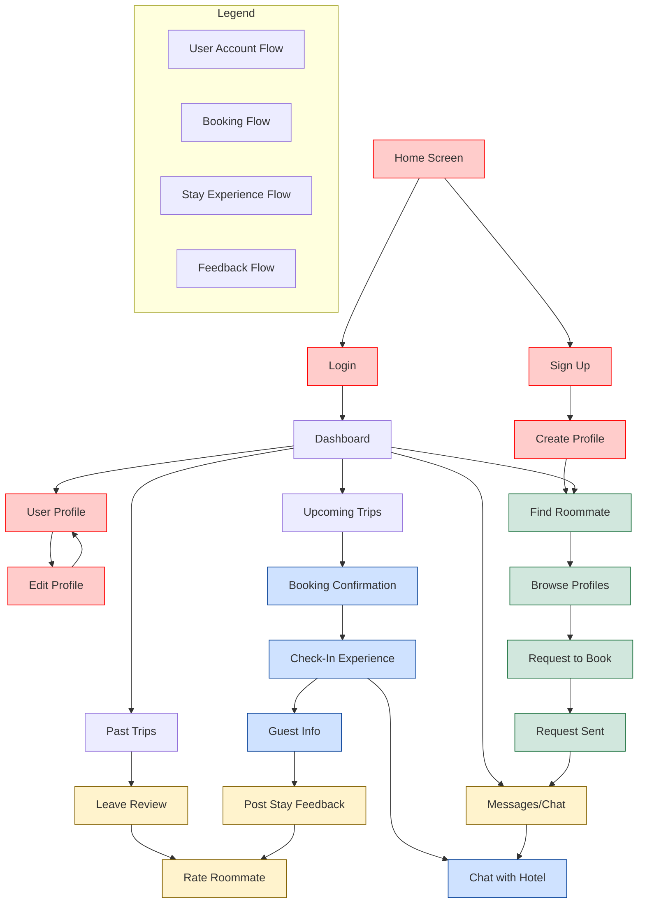

# SplitStay Application Flow

## Screen Descriptions

### User Account Flow
- **Home Screen**: Landing page with app introduction and sign-up/login options
- **Login**: Authentication screen for existing users
- **Sign Up**: Registration screen for new users
- **Create Profile**: Form to create user profile with personal details, preferences
- **User Profile**: View user information, stats, and reviews
- **Edit Profile**: Modify existing profile information

### Booking Flow
- **Find Roommate**: Search for compatible roommates by location, dates, preferences
- **Browse Profiles**: View potential roommates based on search criteria
- **Request to Book**: Send booking request to potential roommate
- **Request Sent**: Confirmation that request was sent successfully

### Stay Experience Flow
- **Booking Confirmation**: Details about the confirmed booking
- **Check-In Experience**: Information for arrival including roommate status
- **Guest Info**: Details about the hotel and stay after check-in
- **Chat with Hotel**: Direct messaging with hotel staff

### Feedback Flow
- **Messages/Chat**: Communication with roommates
- **Leave Review**: Write reviews for hotels and experience
- **Rate Roommate**: Provide feedback on roommate experience
- **Post Stay Feedback**: Overall feedback after completing a stay

## Key User Journeys

1. **New User Path**:
   Home → Sign Up → Create Profile → Find Roommate → Browse Profiles → Request Booking

2. **Returning User Booking Path**:
   Home → Login → Dashboard → Find Roommate → Browse Profiles → Request Booking

3. **Stay Experience Path**:
   Dashboard → Upcoming Trips → Booking Confirmation → Check-In → Guest Info → Post Stay → Rate Roommate

4. **Communication Path**:
   Dashboard → Messages → Chat with Roommate/Hotel

5. **Profile Management Path**:
   Dashboard → Profile → Edit Profile